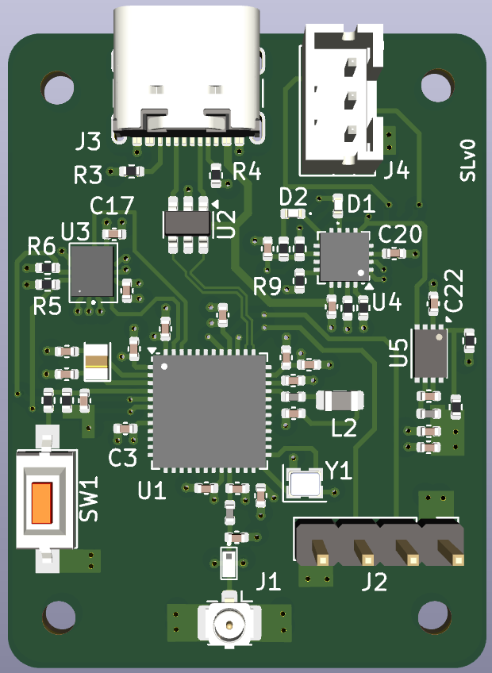
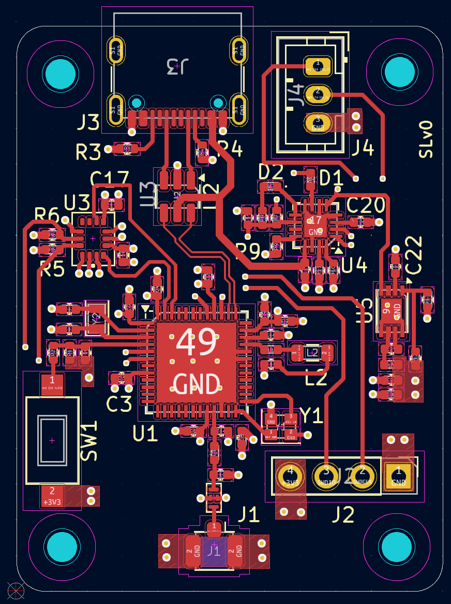
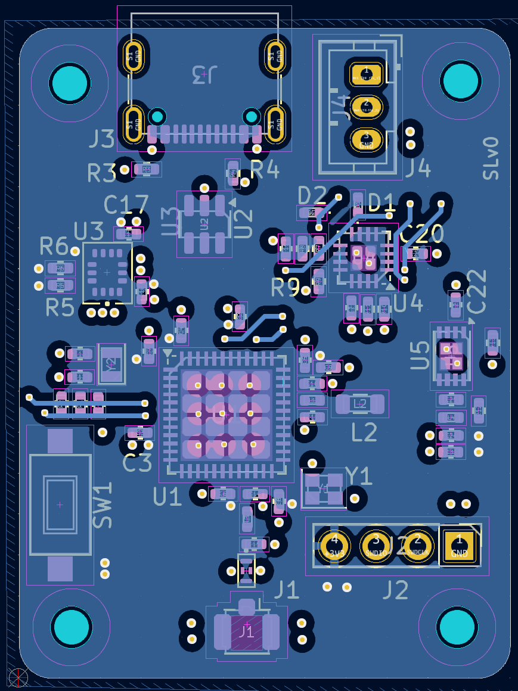
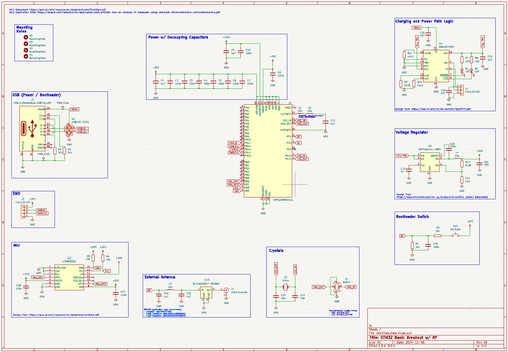

## Overview

This repo contains a 4 layer PCB (signal - ground - ground - power) that contains BLE, IMU, and battery capabilities using
a STM32WB MCU.

This project extends Phil Lab's two part tutorial:

1) Schematic: https://www.youtube.com/watch?v=nkHFoxe0mrU&t=6654s
2) PCB: https://www.youtube.com/watch?v=PlXd3lLZ4vc

This project includes the following additions to the tutorial:

1) Charging IC and peripherals to support LiPo battery (IC was selected to support power path i.e. provide power while charging)
2) ST IMU chip

## Results

### PCB Board

### PCB Routing

Top View:

Bottom View:

### Schematic

